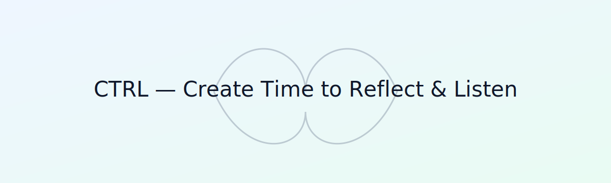

# CTRL — Create Time to Reflect & Listen (Next.js + TS)

A tiny, privacy-first focus aid that nudges you to pause, breathe, and reflect.

**Live:** https://ctrl-create-time-to-reflect-listen-ten.vercel.app



---

## Features
- ⏱️ Gentle “heartbeat” prompts (configurable cadence)
- 🌬️ 4–4–6 breathing widget
- 📈 Local stats only (no accounts, no tracking)
- 💤 Snooze reminders

## Tech
- Next.js (App Router) + TypeScript
- Tailwind CSS
- Vercel for hosting

## Quick Start (dev)
```bash
npm install
npm run dev

npm run build && npm start
